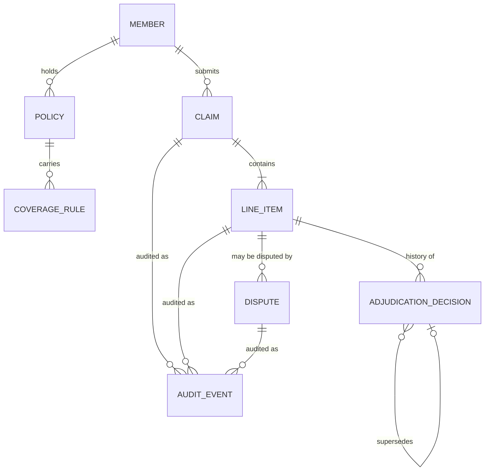
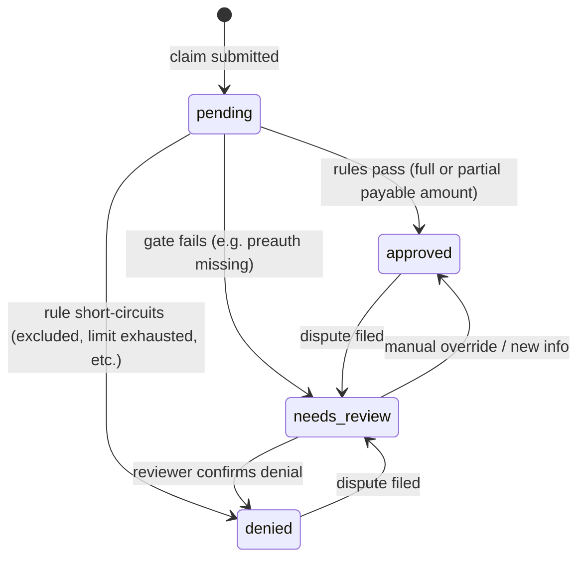
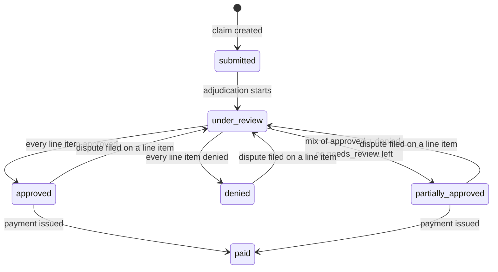

# Domain Model

Entities, relationships, state machines, and invariants of the
claims-processing domain **as implemented** in this submission.
Design choices, application flow, and trade-offs live in
[`decisions.md`](decisions.md).

---

## Overview

A **Member** holds a **Policy**. The policy carries a bundle of
**CoverageRules** that say what's covered, with what limits, and what
cost-sharing applies. The member submits **Claims**, each containing one
or more **LineItems** (individual billable services). The system
**adjudicates** each line item against the policy's rules, producing an
**AdjudicationDecision** with a structured **Explanation**. A claim's
overall status is derived from the states of its line items. Every
adjudication and submission writes an **AuditEvent**.

Members can **file a Dispute** against an `approved` or `denied` line
item, which moves it to `needs_review` for human evaluation. **Dispute
resolution** (reviewer writes a superseding decision) is not shipped —
see [Implementation status](#implementation-status) and
[`decisions.md`](decisions.md).

---

## Design rationale

Why this decomposition:

- **Line item is the adjudication unit.** Coverage rules, limits, and
  cost-sharing attach to `service_type`s and dollar amounts that live on
  line items. A claim is a container; mixing adjudication at claim level
  would blur per-service rule application and make partial approvals
  awkward.
- **Claim state is derived, not stored.** Line items are the source of
  truth; storing claim-level adjudication state risks drift. The only
  persisted claim marker is `paid_at` (payment issued), which is an
  external event line items cannot express.
- **Coverage rules are composable data rows.** Real policies stack
  coverage + limits + cost-sharing on the same service. One row per
  concern keeps rules editable in YAML without code changes and lets the
  same engine serve different policies.
- **Decisions are immutable; re-decisions supersede.** A decision is
  something the member was once shown. Append-only history plus
  `supersedes_id` keeps accumulators honest when a later decision
  overturns an earlier one.
- **Explanations mirror the engine pipeline.** Each phase contributes a
  step (rule fired, inputs checked, amount math). The UI drill-down and
  the API wire format are the same structure.

---

## Implementation status

| Area | Status |
|---|---|
| Member, Policy, CoverageRule, Claim, LineItem | **Shipped** — seeded from `data/*.yaml`, exposed via REST |
| AdjudicationDecision + six-phase engine | **Shipped** — system adjudicates on startup and on `POST /api/claims` |
| AuditEvent (`claim.submitted`, `line_item.decided`, `dispute.filed`, `line_item.state_changed`) | **Shipped** — embedded on claim drill-down + dedicated audit routes |
| Claim `adjudication_state` derivation + `paid_at` guard | **Shipped** — `paid` only when base state is payable and `paid_at` is set |
| QuickClaim UI (list, detail, submit, rule tooltips) | **Shipped** — `GET /api/coverage-rules` for denial tooltips |
| Dispute filing (`POST /api/line-items/{id}/dispute`) | **Shipped** — member files reason; line item → `needs_review`; UI modal + success message |
| Dispute resolution / reviewer override | **Not shipped** — no API or UI to resolve; no `dispute.resolved` |
| Mark claim paid (`paid_at` via API) | **Not shipped** — two seed claims carry `paid_at` for demo only |
| Auth, pagination, Alembic migrations | **Not shipped** — see [Explicitly deferred](#explicitly-deferred-not-built-in-this-submission) |

---

## Entities

### Member

- **Purpose:** the insured person.
- **Fields:**
  - `id` (PK) — string, stable identifier.
  - `name` — string.
- **Relationships:** has many `Policy`, has many `Claim`.
- **Invariants:** none beyond identity.

### Policy

- **Purpose:** the coverage contract held by one member.
- **Fields:**
  - `id` (PK).
  - `member_id` (FK → Member).
  - `name` — e.g. "Standard Health 2026".
  - `effective_date` — date.
  - `termination_date` — date (nullable for open-ended policies; all
    seeded policies have explicit end dates).
  - `annual_deductible` — Decimal.
- **Relationships:** belongs to one `Member`, has many `CoverageRule`.
- **Invariants:**
  - `effective_date <= termination_date`.
  - A member has at most one policy active on any given service date.

### CoverageRule

- **Purpose:** one composable rule about coverage, gates, limits, or
  cost-sharing for a particular service type.
- **Fields:**
  - `id` (PK).
  - `policy_id` (FK → Policy).
  - `service_type` — string (e.g. `physiotherapy`, `mri`).
  - `kind` — enum (see [Rule kinds catalogue](#rule-kinds-catalogue)).
  - `parameters` — JSON, shape depends on `kind`.
- **Relationships:** belongs to one `Policy`.
- **Invariants:**
  - `parameters` must conform to the schema for its `kind`.
  - At most one cost-sharing rule (`copay` *or* `coinsurance`, not
    both) per `(policy, service_type)`. See `decisions.md` for why
    stacking was forbidden rather than defined.

> **Composability:** several rules can apply to the same `service_type`.
> A typical "physiotherapy is covered up to $1,000/year with a $20
> copay" maps to three rule rows: one `service_covered`, one
> `annual_limit`, one `copay`. The engine evaluates them in a fixed
> phase order — see [Evaluation pipeline](#evaluation-pipeline).

### Claim

- **Purpose:** the submission a member sends in. Container for line
  items.
- **Fields:**
  - `id` (PK).
  - `member_id` (FK).
  - `provider_name` — string (no Provider entity; just a label).
  - `service_date` — date care was delivered. Used to pick the active
    policy and to anchor accumulator periods.
  - `submitted_at` — timestamp.
  - `paid_at` — timestamp, nullable. The **only** stored status field
    on a claim; everything else is derived from line items.
- **Relationships:** belongs to one `Member`, has many `LineItem`.
- **Derived:** `adjudication_state` is computed from line items at read
  time (see [Claim lifecycle](#claim-lifecycle)).
- **Invariants:**
  - When an active policy exists on `service_date`, it must cover that
    date (`effective_date <= service_date <= termination_date`). When
    no policy is active, the engine's eligibility phase writes a
    `denied` decision — `POST /api/claims` still returns 201; the
    denial is an adjudication outcome, not an HTTP validation error.
  - `paid_at` may only be set when `adjudication_state ∈ {approved,
    partially_approved}`.

### LineItem

- **Purpose:** one billable service inside a claim. The unit of
  adjudication.
- **Fields:**
  - `id` (PK).
  - `claim_id` (FK).
  - `service_type` — string, must match the vocabulary used in
    `CoverageRule.service_type`.
  - `service_description` — free text, e.g. "MRI of left knee".
  - `charged_amount` — Decimal.
  - `preauth_ref` — string, nullable. Used by the `preauth_required`
    gate.
  - `status` — enum: `pending`, `approved`, `denied`, `needs_review`.
- **Relationships:** belongs to one `Claim`, has many
  `AdjudicationDecision` (history), has many `Dispute`.
- **Derived (from the current decision):** `payable_amount`,
  `member_responsibility`.
- **Invariants:**
  - `charged_amount >= 0`.
  - When a current decision exists: `payable_amount +
    member_responsibility == charged_amount`.

### AdjudicationDecision

- **Purpose:** the immutable record of one adjudication pass on a line
  item. Re-decisions (from manual override or dispute resolution) are
  recorded as *new* decisions that supersede the old one.
- **Fields:**
  - `id` (PK).
  - `line_item_id` (FK).
  - `decided_at` — timestamp.
  - `decided_by` — string (`system`, or a reviewer id for manual
    overrides).
  - `outcome` — enum: `approved`, `denied`, `needs_review`.
  - `payable_amount` — Decimal.
  - `member_responsibility` — Decimal.
  - `deductible_applied` — Decimal. The portion of this line item's
    charge that contributed to the member's annual deductible (the
    `deductible_taken` term in the cost-sharing math). Stored
    explicitly so the member-scoped deductible accumulator is a
    straight SQL sum — see `decisions.md`. Always `0.00` on `denied`
    and `needs_review` decisions.
  - `explanation` — JSON (see [Explanation format](#explanation-format)).
  - `supersedes_id` — FK → AdjudicationDecision (nullable). Set when
    this decision replaces an earlier one for the same line item.
- **Relationships:** belongs to one `LineItem`.
- **Invariants:**
  - A row is never updated after insert. New decisions are inserted
    with `supersedes_id` pointing at the previous current one.
  - At most one decision per line item is "current" (i.e. not pointed
    to by any other row's `supersedes_id`).
  - The line item's `payable_amount` and `member_responsibility` mirror
    the current decision. `status` normally mirrors `outcome` too, except
    after dispute filing: status becomes `needs_review` while the current
    decision row is unchanged.

### Dispute

- **Purpose:** a member's challenge to a specific line item decision.
- **Fields:**
  - `id` (PK).
  - `line_item_id` (FK).
  - `filed_at` — timestamp.
  - `reason` — text.
  - `status` — enum: `open`, `resolved`.
  - `resolution_note` — text, nullable.
  - `resolved_at` — timestamp, nullable.
- **Relationships:** belongs to one `LineItem`.
- **Invariants:**
  - Filing a dispute on a line item in state `approved` or `denied`
    moves it to `needs_review` and produces audit events (`dispute.filed`,
    `line_item.state_changed`). At most one `open` dispute per line item.
  - The current `AdjudicationDecision` row is **unchanged** on filing —
    status moves to `needs_review` while amounts and explanation still
    reflect the prior system decision until a reviewer supersedes it.
  - Resolving a dispute (not shipped) would write a new
    `AdjudicationDecision` that supersedes the previous current one.

**Filing API:** `POST /api/line-items/{line_item_id}/dispute` with body
`{"reason": "..."}`. Returns refreshed `ClaimDetailOut`. Actor is
`member`. No seed disputes — rows are created only when a user files
from the UI.

### AuditEvent

- **Purpose:** immutable, append-only log of everything the system did.
  The thing you read when you need to explain *how* a claim got where
  it is.
- **Fields:**
  - `id` (PK).
  - `event_type` — string. **Written in this build:** `claim.submitted`,
    `line_item.decided`, `dispute.filed`, `line_item.state_changed`.
    **Not emitted yet:** `dispute.resolved`, `claim.paid`.
  - `entity_type` — string (`claim`, `line_item`, `dispute`).
  - `entity_id` — string.
  - `actor` — string (`system`, `member`, `reviewer:<id>`).
  - `occurred_at` — timestamp.
  - `payload` — JSON (before/after state, decision id, etc.).
- **Invariants:** never updated, never deleted.

> **Accumulators are not an entity.** Two on-demand sums drive the
> engine — no `Accumulator` table:
>
> - **Limit accumulator** (service-type-scoped): sum of `payable_amount`
>   over current approved decisions for `(member, service_type, period)`.
> - **Deductible accumulator** (member-scoped, cross-service-type): sum
>   of `deductible_applied` over current approved decisions for
>   `(member, period)`.
>
> See `decisions.md` for why these are computed on demand rather than
> stored.

---

## Relationships



---

## State machines

### Line item lifecycle

Line item state is **stored** on the row. It normally mirrors the
outcome of the current (non-superseded) `AdjudicationDecision`, except
when a dispute is filed: `status` becomes `needs_review` while the
decision row (and derived amounts) stay as they were.



Notes:

- **Partial coverage is `approved`, not its own state.** A line item
  charged $150 with a $80 payable amount (the rest hit a cap) is
  `approved`, with the explanation carrying the "why only $80."
- A dispute filed via `POST /api/line-items/{id}/dispute` moves the
  line item to `needs_review` and the claim to `under_review` when any
  line item needs review.
- **`needs_review` is only ever cleared by a human reviewer** (not
  shipped). The engine never auto-resolves `needs_review`. The intended
  resolution contract: `decided_by = "reviewer:<id>"` with `supersedes_id`
  pointing at the previous current decision.

### Claim lifecycle

Claim state is **derived** from its line items' states. The only
stored claim-status field is `paid_at`.

Derivation rule, applied in order:

1. Look at all line items and derive a base state (`submitted`,
   `under_review`, `approved`, `denied`, `partially_approved`).
2. If `paid_at` is set **and** the base state is `approved` or
   `partially_approved` → `paid`.



Notes:

- `paid` can only be entered from `approved` or `partially_approved` —
  never from `denied` or `under_review`.
- Dispute filing on a line item moves the claim to `under_review` via
  derived state. Disputes are assumed to occur before payment;
  post-payment reopen is not built.

---

## Coverage-rule representation

### Rule kinds catalogue

| `kind` | `parameters` shape | Meaning | Phase |
|---|---|---|---|
| `service_covered` | `{}` | Marks the service type as covered. Required for any payment. | coverage |
| `service_excluded` | `{}` | Explicit exclusion. Short-circuits to `denied`. | coverage |
| `preauth_required` | `{}` | Line item must have a non-null `preauth_ref`, else `needs_review`. | gates |
| `annual_limit` | `{"cap_amount": Decimal, "period": "calendar_year"}` | Plan-paid total for this service type per period is capped. Overage is member's. `period` must be `"calendar_year"` in this build. | limits |
| `copay` | `{"amount": Decimal}` | Flat per-visit member share. | cost-sharing |
| `coinsurance` | `{"member_pct": int}` | % of post-deductible amount the member pays. | cost-sharing |

`service_type` is always on the rule itself, not in `parameters`. The
`period` field on `annual_limit` is kept in the schema; the engine
accepts only `"calendar_year"` — see `decisions.md` for deferred period
kinds (plan year, rolling 12-month, visit counts).

### Evaluation pipeline

For each line item, the engine runs phases in this fixed order. Each
phase either passes (continue), short-circuits (final decision), or
modifies the running amounts.

| # | Phase | Inputs | Possible outcomes |
|---|---|---|---|
| 1 | **eligibility** | active policy on `service_date` | pass / `denied` |
| 2 | **coverage** | matching `service_covered` / `service_excluded` rules | pass / `denied` |
| 3 | **gates** | matching `preauth_required` + `line_item.preauth_ref` | pass / `needs_review` |
| 4 | **deductible** | policy's `annual_deductible` + deductible accumulator | `deductible_taken = min(charged, deductible_remaining)`; `post_deductible = charged - deductible_taken` |
| 5 | **limits** | matching `annual_limit` + accumulator lookup | `coverable = min(post_deductible, limit_remaining)`; the excess is over-limit member-pay |
| 6 | **cost-sharing** | matching `copay` / `coinsurance` rule | computes `plan_pays` and `member_share` on the coverable amount |

Deductible runs before limits — this matches the cost-sharing math
formula below and the "Cost-sharing precedence" entry in
`docs/decisions.md`.

Each phase that fires contributes a step to the line item's
explanation. The order is fixed by the engine, not by the rule rows —
the engine pulls all rules for the line item's `service_type`, groups
them by phase, and processes phases in the order above.

---

## Cost-sharing math

The general formula per line item, assuming the line item gets past
eligibility, coverage, and gates:

```text
deductible_taken    = min(charged, deductible_remaining)
post_deductible     = charged - deductible_taken
coverable           = min(post_deductible, limit_remaining)   # if a limit rule applies; else post_deductible
over_limit          = post_deductible - coverable             # member pays this, full stop
member_cost_share   = cost_sharing_rule(coverable)            # copay or coinsurance, whichever applies; 0 if neither
plan_pays           = coverable - member_cost_share
member_pays         = deductible_taken + member_cost_share + over_limit
```

Rules that govern this math:

- **Deductible is filled before cost-sharing.** The portion that fills
  the deductible is member-paid; the plan contributes nothing to it.
- **Limits cap the *coverable* amount before cost-sharing.** Overages
  do not enter the cost-sharing rule. Crucially, **over-limit amounts
  do not count toward the deductible** — they're uncovered, so they
  cannot help the member fill a plan-defined deductible.
- **Line items within a claim process in submission order** so
  accumulator updates from earlier items are visible to later ones.
- **Across claims**, the startup batch and synchronous submit path use
  `(claim.submitted_at, line_item.id)` so cross-claim accumulator math
  is deterministic.
- **All money is `Decimal`.** Two-place rounding (banker's rounding)
  applied at each step to keep `plan_pays + member_pays = charged` to
  the cent.

---

## Explanation format

Every `AdjudicationDecision.explanation` is a JSON object with the
shape below. The frontend renders the `narrative` for humans; the
`steps` array is for the "show your working" drill-down.

```json
{
  "outcome": "approved",
  "charged_amount": "120.00",
  "payable_amount": "65.00",
  "member_responsibility": "55.00",
  "steps": [
    {"phase": "eligibility",   "rule_id": null,  "result": "pass",    "note": "Policy POL-SH2026 active on 2026-06-23"},
    {"phase": "coverage",      "rule_id": "R1a", "result": "pass",    "note": "general_consultation is covered"},
    {"phase": "gates",         "rule_id": null,  "result": "pass",    "note": "no gates apply"},
    {"phase": "deductible",    "rule_id": null,  "result": "applied", "amount": "30.00", "note": "applied remaining $30 of annual deductible"},
    {"phase": "limits",        "rule_id": null,  "result": "pass",    "note": "no annual limit on general_consultation"},
    {"phase": "cost_sharing",  "rule_id": "R1b", "result": "applied", "amount": "25.00", "note": "flat $25 copay"}
  ],
  "narrative": "Covered under General Consultation. Applied remaining $30 deductible and $25 visit copay. Plan pays $65 of $120 charged."
}
```

For `denied` outcomes, the step that short-circuited has
`result: "fail"` and a `terminating: true` flag. For `needs_review`,
the gate step has `result: "needs_review"` and `terminating: true`.

---

## Invariants

System-wide invariants the engine and persistence layer uphold.

1. **A line item's amounts always sum to its charge.**
   `payable_amount + member_responsibility == charged_amount`.
2. **A claim's adjudication state is always recomputable from its line
   items.** Never store it separately.
3. **`AdjudicationDecision` rows are immutable.** Updates happen by
   inserting a new row that supersedes the previous current one.
4. **Exactly one current decision per line item** (a row not pointed
   to by any other row's `supersedes_id`).
5. **Limit accumulator at time T** = sum of `payable_amount` over all
   current `AdjudicationDecision` rows where outcome is `approved`, the
   line item's `service_type` matches the rule's `service_type`, and the
   claim's `service_date` falls in the rule's period and is strictly
   before T.
6. **Deductible accumulator at time T** = sum of `deductible_applied`
   over all current `AdjudicationDecision` rows where outcome is
   `approved`, scoped to the **member** (all service types) and the
   calendar-year window anchored on each claim's `service_date`, with
   claims strictly before T. Member-scoped, not service-type-scoped.
7. **`paid_at` only set when adjudication state is `approved` or
   `partially_approved`.** Denied claims are never paid. Derivation also
   requires a payable base state before `paid_at` elevates to `paid`.
8. **Every state-changing operation writes an `AuditEvent`** before
   the transaction commits.

---

## Explicitly deferred (not built in this submission)

These were considered, deliberately not built, and tracked so the
reviewer can see they were thought about. Full reasoning in
`decisions.md`.

| Item | Current handling | What we'd do if we built it |
|---|---|---|
| Dispute resolution | Filing shipped; `dispute.resolved` and reviewer superseding decision not built | Reviewer API + UI; new `AdjudicationDecision` with `decided_by = reviewer:<id>` |
| Mark claim paid | `paid_at` on two seed claims only; no HTTP route | `POST` or patch to set `paid_at` when base state is payable; `claim.paid` audit event |
| Limit periods other than calendar year (plan year, rolling 12-month) | Engine accepts only `period: "calendar_year"` on `annual_limit` rules | Generalise the period-to-date-range function; everything else stays the same |
| Visit-count limits (e.g. "20 physio visits/year") | Not modelled | New rule kind `visit_count_limit` with the same shape as `annual_limit` but counting line items instead of summing dollars |
| Preauthorization as a first-class entity | String `preauth_ref` on `LineItem`; presence is the only thing checked | Promote to a `Preauthorization` entity with issuance date, expiry, scope; the gate phase looks up by reference and checks validity |
| Provider as a first-class entity | String `provider_name` on `Claim` | Promote to `Provider` entity; enables network/tier-based rule kinds |
| Reopening a claim after `paid` | Not allowed; disputes assumed to occur pre-payment | Either track a `reopened_at` separately from `paid_at`, or model payments as their own entity with reversal events |
| Out-of-pocket maximum (OOPM) | Not modelled; plan-side cost-sharing applies on every covered line item with no annual cap on member responsibility | Add `annual_oopm` to `Policy` and a member-scoped OOPM accumulator (same shape as the limit accumulator); the cost-sharing phase short-circuits to zero once the accumulator hits the cap |
| Combined cost-sharing on one service (e.g. "$250 copay + 20% coinsurance for ER") | Forbidden by invariant: at most one cost-sharing rule per `(policy, service_type)` | Add a new rule kind (e.g. `copay_plus_coinsurance`) with both parameters and explicit stacking math, rather than letting two existing rules stack |
